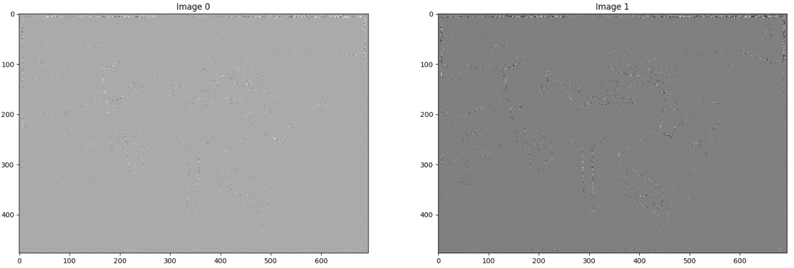

 
## Description

I built a series of programs which explored different computer vision concepts as a part of my Computer Vision course at UCSD. 

## Photometric Stereo

In this section, I explored the concept of Lambertian Photometric Stereo. Initially, we took in multiple images with a corresponding light source direction and estimated their surface normals and albedo map. After that, we reconstructed the depth map from the surface with a Horn integration technique. Following are the visualizations of the images, albedo map, and surface normals.

|  |  |  |  |
| ------------------- | ------------------- | ------------------- | ------------------- |
|  Image 1|  Image 2|  Image 3|  Albedo Map|

 Surface Normals as 3 seperate channels 

|  |  |
| ------------------- | ------------------- | 
|  Normals as Quivers |  Wireframe Depth Map|

## Image Rendering

In this part, I rendered an image of a face with two different point light sources using a Lambertian reflectance model. To recreate the 3d image I used two albedo maps, the light sources, and a height map. In the end, I rendered 6 images for each combination of albedo and light source

|  |  |  |
| ------------------- | ------------ | ------------------- | 
|  Face Albedos |  Heightmap|  Surface Normals|

## Edge and Corner Detection

To implement edge detection, I first smoothed the images using a 9x9 Gaussian kernel so that I didn't accidently consider any noise as an edge. I then computed the image gradient in the horizontal and vertical directions to finish isolating the edges.

|  |  |  |  |
| - | - | - | - |
|  Original|  Smoothed|  Gradient Magnitude|  Gradient Direction|

To implement corner detection, we made use of the properties of the second moment matrix of local regions in the image. By making use of this matrix, I was able to find 100 corners with the largest minor eigenvalues.

## SSD and NCC Matching

In order to find matching correspondances between two images, I implemented two methods: Sum Squared Difference(SSD) Matching and Normalized Cross-Correlation(NCC) Matching. The first one computed the "matching score" between two images using the sum squared difference of two windows. Using the NCC Matching function, I then created a naive matching function to find the best matches between two images and display them. 

$$
    SSD = \sum_{x,y} |W_1(x,y) - W_2(x,y)|^2
$$

$$
    NCC = \sum_{x,y} \tilde{W}_1(x,y) \cdot \tilde{W}_2(x,y)
$$
$$
    \text{where } \tilde{W} \text{ is a mean-shifted, normalized version of W}
$$

## Epipolar Geometry

Since the naive matching function had some obvious errors due to the high matching complexity, I further explored epipolar lines as an additional factor to link two images. I began with computing the Fundamental Matrix for each image and plotted the epipolar lines through some corners found using the previous corner method.

| | | |
| - | - | - |
|  | | |
|  | | |

## Image Classification Using Bag-of-words

Putting together everything I have learned, I created a simple classifier using the bag-of-words method. First, I select some regions in the images from which I can extract some features. I did this in two different ways: uniformaly sampling and sample on corners. 

After getting my interest points, I went on to extracting my features through two methods. The first one was OpenCV's SIFT function and the second was by selecting image patches around each feature point. From here, I built a visual vocabulary using k-means clustering as implemented in sklearn's cluster library. I first compared each feature vector with the k-cluster centers and assigned it to the closest cluster. I then updated the cluster center by taking the average of all the points that were assigned to it and repeated these two steps until there were no more changes to the cluster centers. Now that the clusters were defined, I went on to use the k-nearest neighbors to compare test images and classify my images. Following is my resulting test accuracies for 3-NN and 5-NN.

