 
## Description

I built a series of programs which explored different computer vision concepts. 

## Photometric Stereo

In this section, I explored the concept of Lambertian Photometric Stereo. Initially, we took in multiple images with a corresponding light source direction and estimated their surface normals and albedo map. After that, we reconstructed the depth map from the surface with a Horn integration technique. Following are the visualizations of the images, albedo map, and surface normals.

|  |  |  |  |
| ------------------- | ------------------- | ------------------- | ------------------- |
| 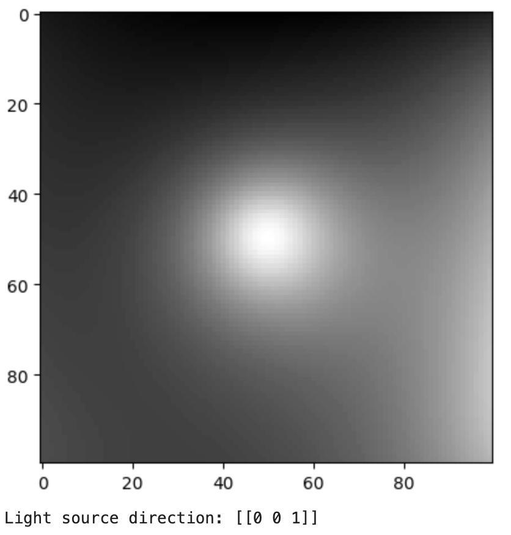 Image 1| 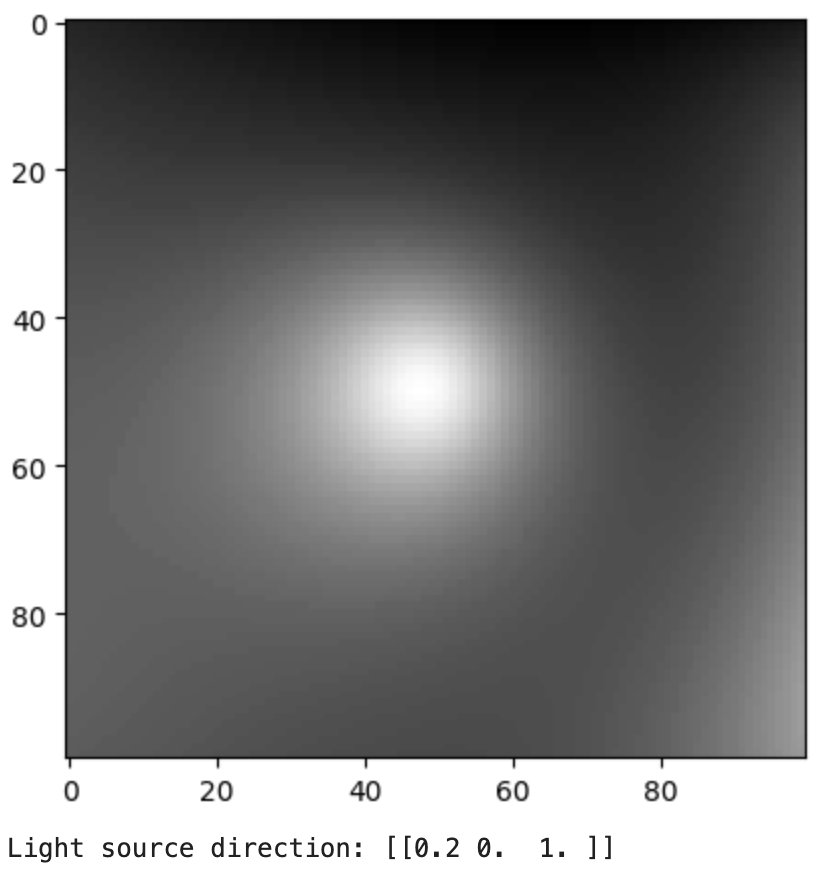 Image 2| 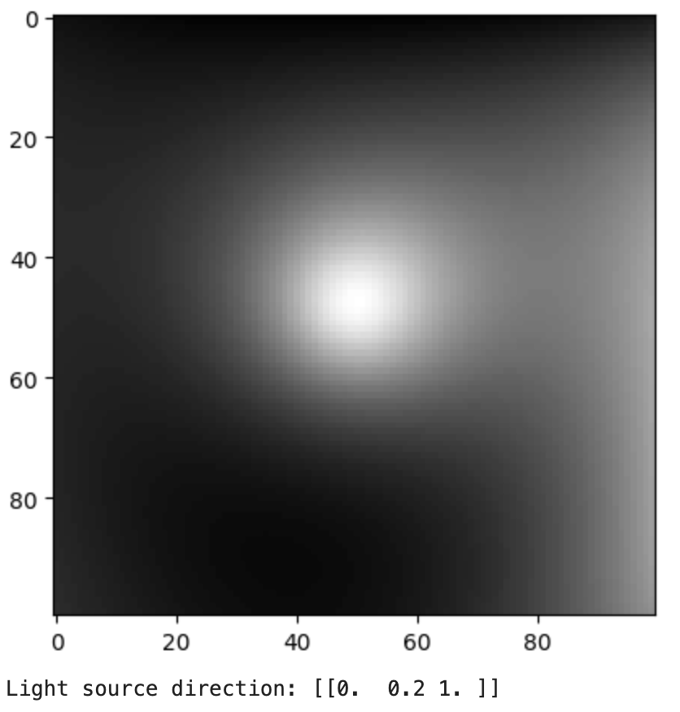 Image 3| 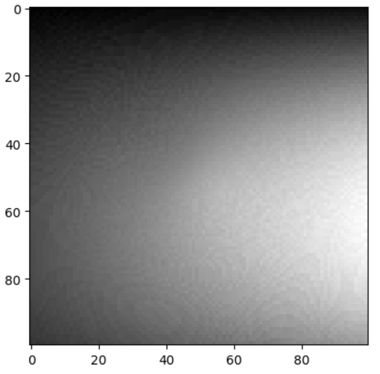 Albedo Map|

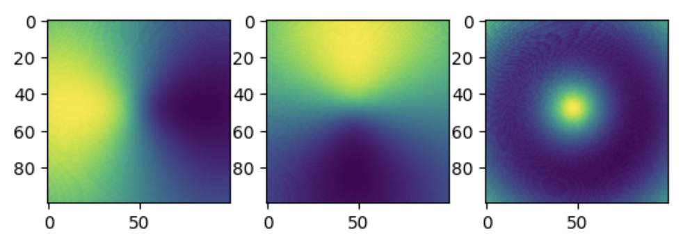 Surface Normals as 3 seperate channels 

|  |  |
| ------------------- | ------------------- | 
| 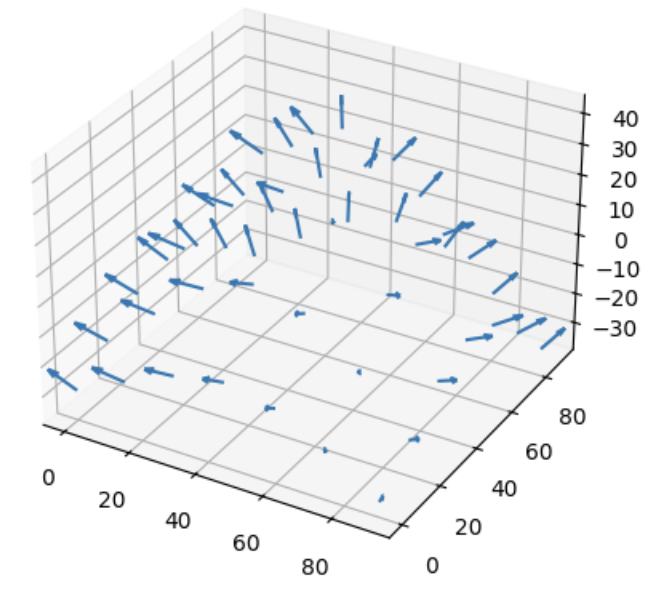 Normals as Quivers | 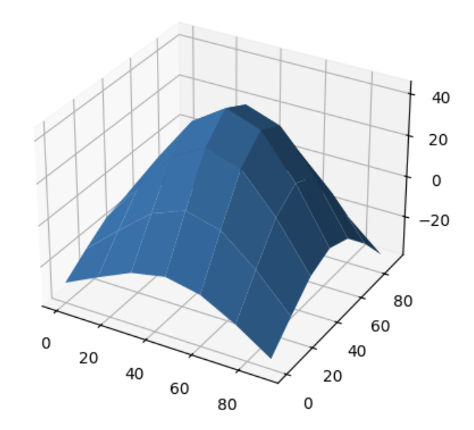 Wireframe Depth Map|

## Image Rendering

In this part, I rendered an image of a face with two different point light sources using a Lambertian reflectance model. To recreate the 3d image I used two albedo maps, the light sources, and a height map. In the end, I rendered 6 images for each combination of albedo and light source

|  |  |  |
| ------------------- | ------------ | ------------------- | 
| 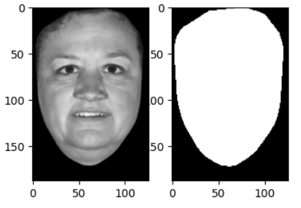 Face Albedos | 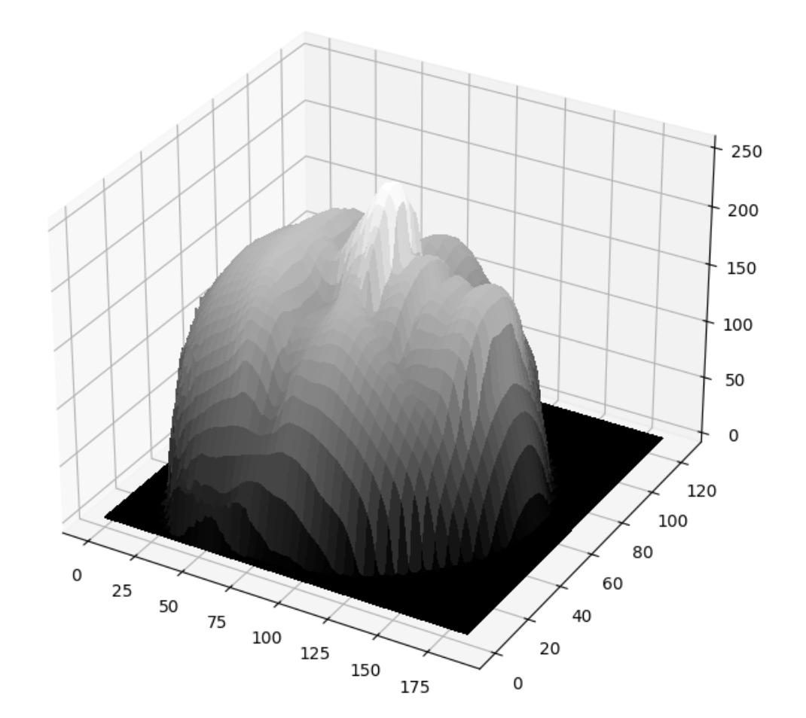 Heightmap| 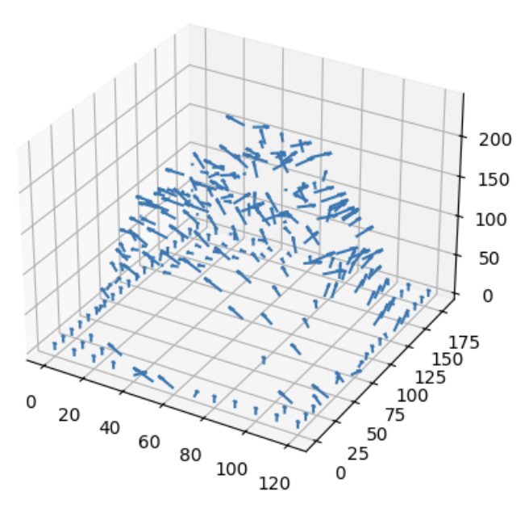 Surface Normals|

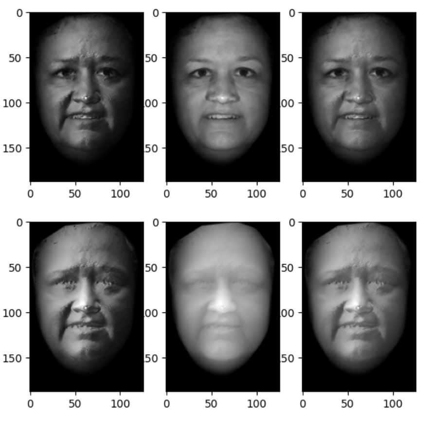