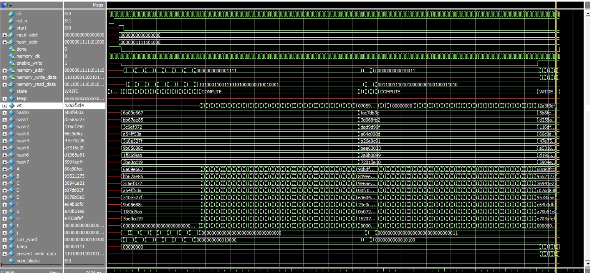
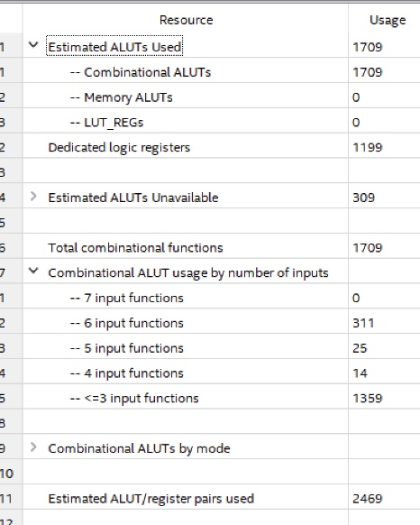
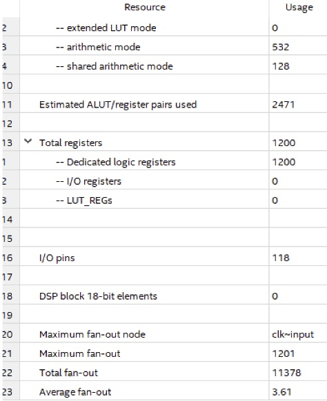
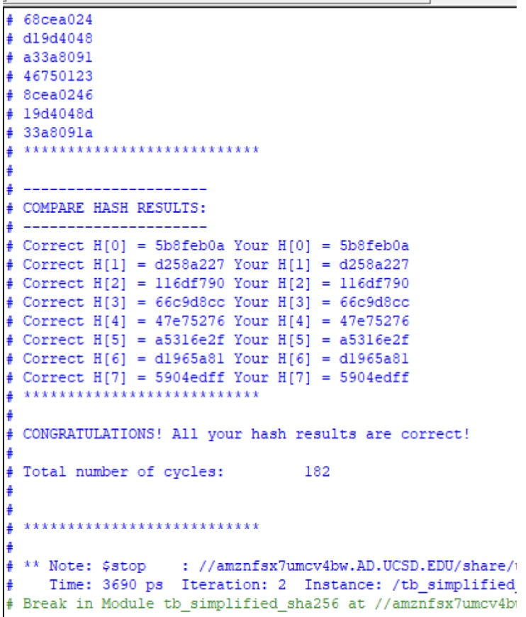

### [Link to Github](https://github.com/aktyagiUCSD/ECE-111-Final-Project)

## SHA-256 Encoder
### Objective:

The SHA-256 Algorithm aims to provide a integrous way of transferring data from one person to another.
Rather than security, it is more important to prevent changes in transit from a malicious 3rd party.
Our goal in this project was to create an accurate FPGA implementation that allocates resources efficiently.

### Description:

Given a message as input.
1. Divide message into blocks of 512 bits with final block padded by

    ```{1, 00 … 0, length of the message}```

2. Process blocks individually through the algorithm

    - Block undergoes word expansion 
    - Letters are then translated according to predetermined hash values
    - Repeat for every block

3. Final outputted hash value must be 256 bits

### Design Challenges:

Our SHA_256 currently only works when up to 2 blocks are inputted.

### Optimizations:

- Optimized word expansion to use 16 words instead of 64
- Optimized SHA_256 algorithm to use w[0] every iteration instead of an iterator of w

#### Simulation:



#### FPGA Resource Summary :

|  |  |
|  --------------------------------------- | ---------------------------------------- |
|  |  |

#### Testbench Results:



## Bitcoin Hashing
### Objective:

The Bitcoin Hashing Algorithm chains blocks of data together in order to securely store transaction data.
The Bitcoin Hashing algorithm builds off the SHA-256 Algorithm by appending nonce values to the end of the data and chaining the blocks together.
Our goal when working on this Bitcoin Hashing implementation was to balance area and parallelization. 
Since it takes up to much physical space to create 16 different sha_256 modules, we considered only creating 8 instances and running it twice. 
However, our final implementation runs 16 blocks in parallel due to its shorter delay. The downside of this implementation is that it requires more resources to build.

## Design Challenges:

Since we working on both this algorithm and the SHA-256 module at the same time, we had to build this module under the assumption that the SHA-256 module worked.

## Optimizations:

- Made use of Quartus's in-built area optimizations
- Sacrificed resources to decrease delay by running 16 blocks in parallel