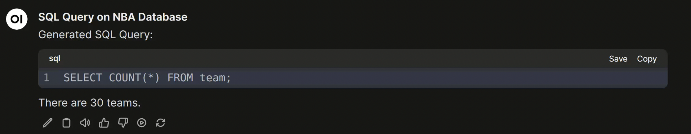
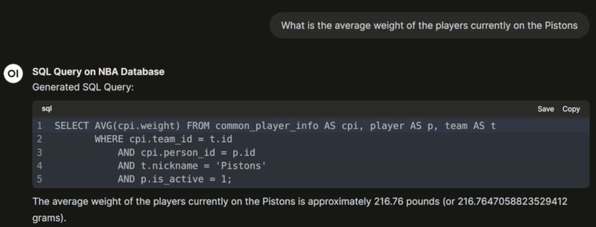

### [Link to Github](https://github.com/AshwinKTyagi/OpenWebUIScripts/blob/main/nba_text_to_sql_pipeline.py)

## Project Description

I created an AI Pipeline that can query a NBA Database using natural language questions, generate an appropriate SQL query and retrieve the answer. Through this project, I learned how to create a useful tool that can be modified to any SQL database or usecase. However, due to my love for basketball, I created it to get NBA data from a related Postgres Database.

### OpenWebUI and Pipelines

A key part of my tech stack is OpenWebUI, which is a lightweight, customizable interface for interacting with local llms. This platform allows developers to create their own personalized, locally-hosted ChatGPT. It also supports custom pipelines which let you define how inputs and outputs are processed in a multi-step flow.

In this project, I used OpenWebUI's pipeline system to define:

1. __User Input__: Users input natural language questions about NBA data.
    ```
        How many teams are there in the NBA?
    ```
2. __Text-to-SQL model processing__: Using Retrieval Augmented Generation(RAG) to infer the structure of our database, the LLM generates an accurate SQL query.
    ```sql
        SELECT COUNT(*) FROM team;
    ```
3. __SQL query execution against my NBA database__: The SQL query is then run against the database and gets a default SQL response.
    ```
        30
    ```
4. __Formatted Answer Returned to the User__: The Answer from our Database is then turned into Natural Language such that the user can make sense of it.
    
    


By using Pipelines, I was able to focus on each step modularly and keep the architecture clean.


## Building the Pipeline

### 1. Designing the NBA Stats Database

Using __PostgreSQL__, I built a relational database containing structured NBA stats pulled from a public [Kaggle dataset](https://www.kaggle.com/datasets/wyattowalsh/basketball). My schema included tables like:

- `player`: player names, ids, and if they are active.
- `common_player_info` : all other related player information, such as height, weight, and what team they are on.
- `team`: id, team name, nickname, location, and year founded

I did not modify the structure or schema of the database at all, in an effort to create a script that is not reliant on a database's schema but rather the script's design.

### 2. Text to SQL Conversion

For the natural language understanding piece, I experimented with different open-source LLM models such as Mistral, LLaMa2.1, and LLaMa3 to see which could handle the queries in a consistent manner. The pipeline sends prompts to the model with the help of a Natural Language to SQL library to generate SQL given the current schema and user question. 

This step was unexpectedly tricky, because the NLSQL tool wasn't the most accurate for more complex queries. To handle this, I __manually validated and generated test queries__ to handle as many of the common patterns as I could find. In one case, the library couldn't handle `JOINS` using multiple tables and would instead attempt to run nested loops, which resulted in incorrect answers. So, I provided an test query that told the LLM how to handle these.

For example, the question `Who are the active players on the Kings?` required imformation from three different tables:

- The `player` table tells us if a player is active or not
- The `common_player_info` table tells us what a player's current team is(in the form of a team_id)
- The `team` table connects the team_id with the nickname *Kings*

So, to avoid nested loops, I provided the following query:
```sql
SELECT p.full_name 
    FROM common_player_info AS cpi, player AS p, team AS t 
    WHERE cpi.team_id = t.id 
        AND cpi.person_id = p.id 
        AND t.nickname = 'Kings' 
        AND p.is_active = 1;
```

This allowed my pipeline to handle any related question which connects these three tables.



### 3. Safe and Effectice SQL Execution

Once the SQL is generated, the pipeline:

- Parses and Validates the SQL
- Executes it against the NBA PostgreSQL database

### 4. Formatting Output

Once the output of our query is returned, I gave the LLM instructions to synthesise the output such that the generated SQL query and output are returned in a human-readable way. This part of the pipeline can still use a little work, since some information about the data colums; such as units for weight and height, need to be explicitly defined. 

## What's Next

There is a lot that can be done to improve this project. First and foremost, I need to check if this UI is safe from SQL attacks. If not, I would need to change some of the prompts for SQL generation such that the database is not harmed. Also, this pipeline can easily be adapted to more relavant datasets. While I am currently using it on NBA data, this script can be used to help interactions with business data for people who are less familiar with SQL.

## Final Thoughts

This project is a great example of how powerful LLMs can be when paired with structured data and a clean user interface. Whether you’re a basketball nerd like me or just curious about the tech, it’s exciting to see how natural language can open doors to rich, data-driven insights.

If you’re interested in building something similar or want to collaborate, feel free to reach out! The code is modular, and I’m happy to share what I’ve learned.